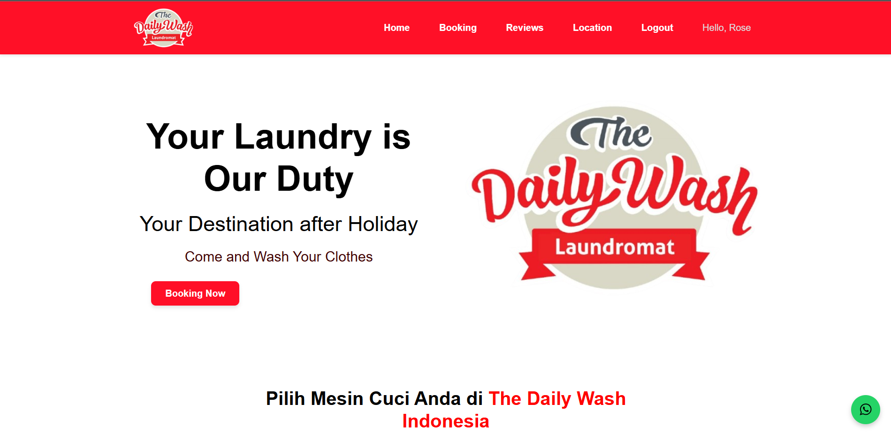

<p align="center">
  
</p>

<h1 align="center">🧺 Washing Machine Orders & Laundry Management System</h1>

<p align="center">
  Sistem booking mesin cuci dan manajemen laundry berbasis website dengan Laravel.  
  Dibuat untuk mempermudah pelanggan dalam melakukan pemesanan mesin cuci serta membantu admin dalam mengelola layanan laundry koin.
</p>

---

## 🚀 Fitur Utama
- Multi-auth (Admin & Customer)
- Booking mesin cuci online
- Integrasi pembayaran **Midtrans**
- Notifikasi email pengingat booking
- Dashboard admin:  
  - CRUD mesin cuci  
  - Laporan keuangan (export PDF)  
  - Manajemen pembayaran pelanggan  

---

## 🛠️ Tech Stack
- **Framework:** Laravel  
- **Frontend:** Bootstrap, JavaScript  
- **Database:** MySQL  
- **Payment Gateway:** Midtrans  

---

## 📸 Screenshots
(Tambahkan gambar biar lebih menarik, contoh:)

  


---

## 📂 Cara Install
1. Clone repo ini
   ```bash
   git clone https://github.com/username/washing-machine-orders-and-laundry-management.git 
2. Masuk ke folder project
   ```bash'''bash'''
   cd washing-machine-orders-and-laundry-management
4. Install Dependency
   ```bash
   composer install
   npm install
6. buat file .env dan sesuaikan konfigurasi database & Midtrans
7. Migrasi database
   ```bash
   php artisan migrate --seed
9. jalankan server
    ```bash
   php artisan serve

---

## 📖Tentang Project 
Project ini merupakan bagian dari Tugas Akhir dengan judul:
"Sistem Booking Mesin Laundry Koin dengan Metode Personal Extreme Programming (Studi Kasus The Daily Wash Ketintang)".
Sistem ini diharapkan dapat:
- Meningkatkan efisiensi pengelolaan laundry berbasis koin.
- Memudahkan pelanggan melakukan booking mesin dari mana saja.
- Memberikan transparansi pembayaran & laporan bagi admin.

---

👩‍💻 Author

Ririn – Full Stack Developer
    Kontak: [Linkedln](https://www.linkedin.com/in/khofifahdharmasari/) 
            Email khofifahdharmasari7@gmail.com 

---

📜 License

Project ini open-source di bawah lisensi [MIT](https://opensource.org/license/MIT?utm_source=chatgpt.com).
